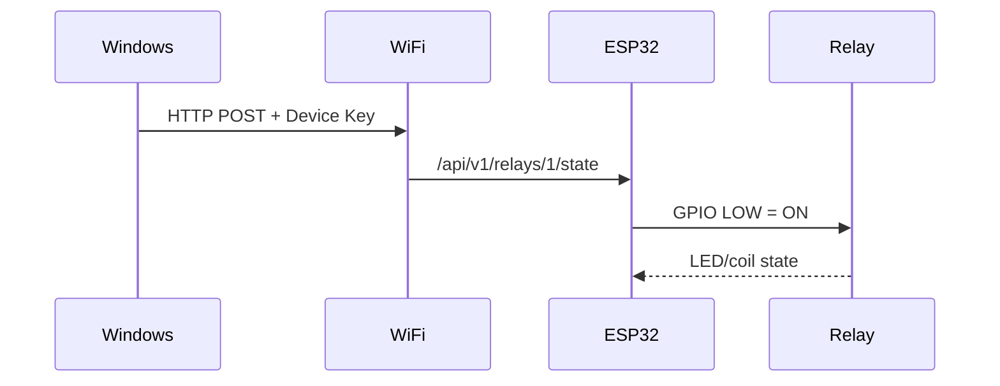

# ทดสอบ Hardware, Wi‑Fi, REST API และ Relay

อ่าน [FLASH-GUIDE.md](FLASH-GUIDE.md) ให้จบก่อน

## กฎความปลอดภัย

ทดสอบ Relay โดยใช้ LED ของโมดูลหรือเสียงคลิกก่อนเสมอ ไฟบ้านต้องเป็นหน้าที่ช่างไฟฟ้า

## GPIO ที่ใช้จริง

| ช่อง Relay | GPIO |
|---:|---:|
| 1–2 | 13, 14 |
| 3–4 | 16, 17 |
| 5–8 | 18, 19, 25, 26 |

Relay เป็น **Active LOW**: `LOW = ON`, `HIGH = OFF` ใน Firmware

## หา IP ของ ESP32

ดู Serial Monitor หลังเชื่อม Wi‑Fi แล้วจด IP ที่รายงาน เช่น `192.168.1.50` เรียกว่า `DEVICE_IP` ด้านล่าง

## ทดสอบใน Browser

เปิด:

```text
http://DEVICE_IP/api/v1/health
http://DEVICE_IP/api/v1/relays
```

ควรเห็นข้อมูล JSON และ Relay ที่เปิดใช้ตามจำนวนช่อง

## เปิด/ปิดหนึ่งช่องด้วย curl

เปิด Command Prompt แล้วแทน `DEVICE_IP` และ `DEVICE_KEY` ด้วยค่าจริง:

```powershell
curl -X POST http://DEVICE_IP/api/v1/relays/1/state -H "Content-Type: application/json" -H "X-Lucky-Device-Key: DEVICE_KEY" -d "{\"state\":\"ON\"}"
curl -X POST http://DEVICE_IP/api/v1/relays/1/state -H "Content-Type: application/json" -H "X-Lucky-Device-Key: DEVICE_KEY" -d "{\"state\":\"OFF\"}"
```

ใน Postman ให้เลือก Method `POST`, ใส่ URL, Header สองรายการ และ Body → raw → JSON เช่น `{"state":"ON"}`

[Screenshot: Postman Relay ON]

คาดหวัง: LED ของ Relay ช่อง 1 เปลี่ยนสถานะและได้ยินเสียงคลิกเบา ๆ เมื่อ ON/OFF

## ทดสอบ 2/4/8 ช่อง

อ่านจำนวนปัจจุบัน:

```powershell
curl http://DEVICE_IP/api/v1/config/relay
```

ตั้งค่าเป็น 2, 4 หรือ 8 (ทุกช่องจะ OFF ก่อนเปลี่ยน):

```powershell
curl -X POST http://DEVICE_IP/api/v1/config/relay -H "Content-Type: application/json" -H "X-Lucky-Device-Key: DEVICE_KEY" -d "{\"relayCount\":4}"
```

ทดลองเฉพาะช่อง 1 ถึงจำนวนที่เลือก ช่องที่เกินจำนวนต้องตอบ 404 และต้องไม่ทำงาน



### ✓ Expected Result

GET ใช้ได้โดยไม่ต้องใส่ Key; POST ที่มี Key ถูกต้องควบคุมเฉพาะช่องที่เปิดใช้ได้

### ✓ Common Mistakes

- ใช้ URL ของ server ร้าน แทน IP ของ ESP32
- ลืม `X-Lucky-Device-Key`
- ส่ง `on` แทน `ON`

### ✓ How to Fix

ใช้ IP จาก Serial Monitor, ใส่ Header ให้ครบ, และใช้ค่า `ON` หรือ `OFF` ตัวพิมพ์ใหญ่เท่านั้น
