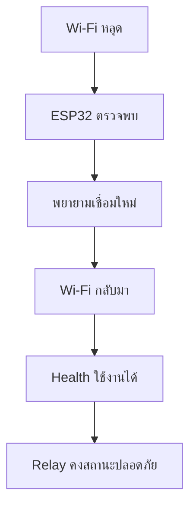

# ทดสอบไฟดับและ Wi‑Fi หลุด

## A. Power Loss Test

1. ทดสอบ Safe Boot ก่อนตาม [SAFE-BOOT-TEST.md](SAFE-BOOT-TEST.md)
2. ตั้ง Relay ทุกช่อง OFF ด้วย `POST /api/v1/relays/all/off`
3. ถอดไฟ ESP32
4. รอ 10 วินาที แล้วต่อไฟใหม่
5. รอ `BOOT_COMPLETE`
6. ตรวจ `GET /api/v1/relays` ว่าทุกช่อง OFF
7. บันทึกผล วัน เวลา และผู้ทดสอบ

## B. Wi‑Fi Test

1. ให้ ESP32 เชื่อม Wi‑Fi ก่อน
2. ปิด Router หรือปิด Wi‑Fi ชั่วคราว
3. ตรวจ Serial Monitor ว่าแจ้งการหลุดและพยายามเชื่อมใหม่
4. เปิด Router/Wi‑Fi กลับ
5. รอให้ ESP32 เชื่อมใหม่ แล้วเรียก `/api/v1/health`
6. ตรวจว่า Relay ไม่เปิดเองจากการ Wi‑Fi หลุด/กลับมา

### ✓ Expected Result

หลังไฟกลับมา Relay ทุกช่อง OFF; หลัง Wi‑Fi กลับมา API health ใช้งานได้โดยไม่มีคำสั่งเปิด Relay เอง

### ✓ Common Mistakes

- สับสนระหว่างไฟ Router กับไฟ ESP32
- รีบส่งคำสั่ง API ก่อน ESP32 เชื่อม Wi‑Fi สำเร็จ

### ✓ How to Fix

ทดสอบทีละเหตุการณ์ และรอ Serial Monitor/health ยืนยันสถานะก่อนขั้นต่อไป
