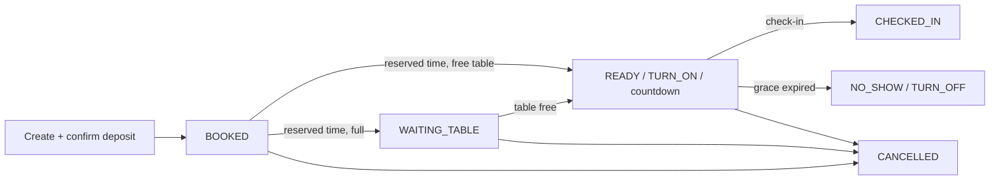
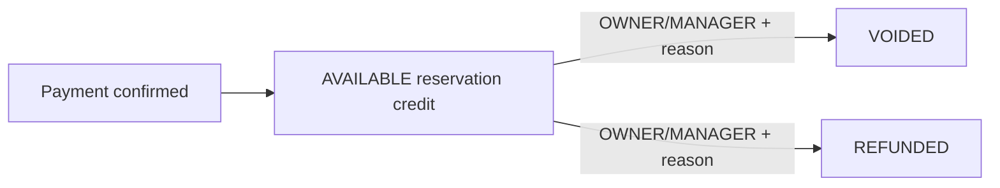

# Sprint 10A — Smart Reservation & Deposit Lifecycle

## Architecture summary

Reservations and reservation deposits are independent JSON aggregates stored in `data/reservations.json` and `data/reservation-deposits.json`. `ReservationService` owns booking, queue, assignment, check-in, cancellation, and no-show transitions. `ReservationDepositService` owns the reservation-credit liability and its guarded void/refund transitions. Neither service imports or calls Billing, Loyalty, SQLite, or Table Session.

## Reservation lifecycle

## Deposit lifecycle

`AVAILABLE` remains unchanged after cancellation or no-show. Deposits are excluded from bill and revenue calculations.

## APIs

- `GET/POST /api/reservations`
- `PATCH /api/reservations/:id`
- `PATCH /api/reservations/:id/check-in`
- `PATCH /api/reservations/:id/cancel`
- `PATCH /api/reservations/:id/no-show`
- `GET /api/reservation-deposits`
- `PATCH /api/reservation-deposits/:id/void`
- `PATCH /api/reservation-deposits/:id/refund`
- `GET /api/reservation-dashboard`
- `GET /api/reservation-reports/:type` (`reservations`, `deposits`, `outstanding-deposits`, `refunds`, `no-shows`, `queue`)

## Dashboard, reports, ESP32, and audit

Dashboard metrics cover today's reservations/deposits/refunds/no-shows, outstanding deposits, waiting queue, and ready check-ins. Report endpoints expose all six requested report views. READY sends TURN_ON when enabled; NO_SHOW and cancellation after READY send TURN_OFF; CHECKED_IN sends no relay command.

Audit events: `RESERVATION_CREATED`, `DEPOSIT_RECEIVED`, `CHECK_IN`, `NO_SHOW`, `CANCELLED`, `DEPOSIT_VOIDED`, `DEPOSIT_REFUNDED`.

## Known limitations

- Deposit settlement into Billing is intentionally deferred.
- CHECKED_IN does not start or mutate a Table Session in this sprint.
- Runtime polling is in-process every 30 seconds; an offline server processes overdue transitions on the next state/list request.
- Relay delivery follows the existing best-effort ESP32 transport.
