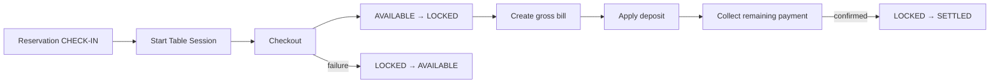

# Sprint 10B — Deposit Settlement & Billing Integration

## Architecture

`DepositSettlementService` is the integration boundary between reservation credit and the existing JSON Billing workflow. Billing Core continues producing the gross bill. The integration layer adds deposit metadata to that draft and Payment collects only `remainingPaymentSatang`.

No SQLite schema, Loyalty logic, existing Billing route, or legacy JSON repository was replaced.

## Settlement flow

The bill retains its original `totalSatang` and `total` for revenue. Added fields are `reservationId`, `depositId`, `depositAppliedSatang`, `grossTotalSatang`, `remainingPaymentSatang`, `depositSettlementAt`, and `depositSettlementBy`.

## Receipt and reporting

Receipts now show the table/product gross amounts, reservation deposit as a negative credit, remaining payment, payment method, and unchanged total bill. Dashboard adds settled-today, available, and outstanding-including-locked deposit values.

`GET /api/reports/deposit-settlement` returns reservation number, deposit receipt, bill number, gross total, applied deposit, remaining payment, settlement date, and cashier.

## Audit and concurrency

Added events: `DEPOSIT_LOCKED`, `DEPOSIT_APPLIED`, `DEPOSIT_SETTLED`, and `DEPOSIT_UNLOCKED`. Deposit lock, unlock, and settle repository operations require the current version. Repeating the same lock token or settlement bill is idempotent.

## Known limitations

- Reverse settlement remains deferred. Voiding a settled bill intentionally leaves its deposit `SETTLED`.
- Refund after settlement is rejected until a future reverse-settlement flow exists.
- If a deposit exceeds the gross bill, only the gross amount is applied; the deposit is recorded as settled with that applied amount.
