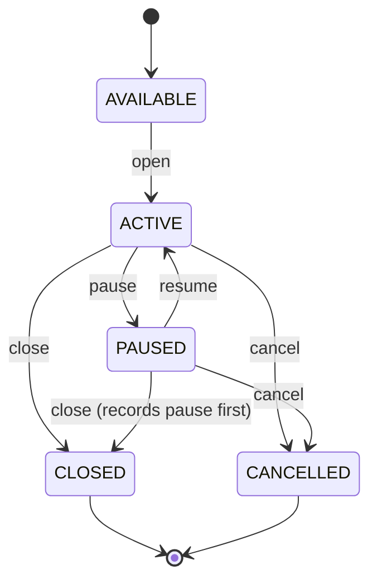

# Sprint 1 — Settings, Pricing & Table Session Foundation

## Scope and compatibility

JSON remains production storage. SQLite is not opened by the application runtime. Existing page structure and routes remain; the existing `PUT /api/settings` route now delegates to `SettingsService` through `JsonSettingsRepository`, while retaining legacy `hourlyRate` and `minimumCharge` fields in baht for the current UI.

## Settings architecture

```text
Express settings route
  -> SettingsService
  -> JsonSettingsRepository
  -> current in-memory JSON store / existing save()
```

Settings Service normalizes and validates shop name/legacy rates plus the new foundation fields: `timeZone` (Asia/Bangkok), `currency` (THB), `dateTimeFormat`, `minimumChargeSatang`, `roundingRule`, `backupIntervalHours`, `esp32` base configuration, `defaultPricingProfileId`, and `pricingProfiles`. Unknown legacy values remain preserved for compatibility. Routes do not read settings files directly.

## Pricing and money policy

- New domain values use **integer satang** only: `100.00 THB = 10000`.
- `bahtToSatang` accepts at most two decimal places; `satangToBaht` returns a two-decimal display string.
- A pricing profile has `unit` (`HOUR` or `MINUTE`), `rateSatang`, `minimumChargeSatang`, `roundingRule`, and reserved weekday/time rules.
- Supported rounding policies are `NONE`, `UP_TO_BAHT`, and `NEAREST_BAHT`.
- Future time/day pricing selects a profile before opening a session. Promotion logic is deliberately absent.
- Existing billing continues using its legacy float calculation in this sprint; it is not silently converted. A dedicated billing migration/cutover is required before money policy is live end-to-end.

## Session lifecycle



`AWAITING_PAYMENT` is reserved in the state model for a later billing handoff. It cannot be entered by Sprint 1 services. Only one open state (`ACTIVE`, `PAUSED`, `AWAITING_PAYMENT`) is allowed per table.

## Session service and snapshot

`TableSessionService` supports open, pause, resume, close, and cancel through `JsonSessionRepository`. It validates table existence, duplicate active session, time ordering, price configuration, invalid transition, and negative amounts. A copy of the normalized pricing profile is saved in `pricingSnapshot` at open time. Later profile/settings changes do not change the session's final charge.

```text
Future Route / IPC
  -> TableSessionService
  -> Session Repository interface
  -> JSON repository now / SQLite repository later
```

The service is intentionally not wired into the existing start/checkout routes yet because their legacy table/bill JSON shape and float billing would require a controlled billing cutover. This preserves current production behaviour while making the new lifecycle testable.

## Validation rules

| Rule | Enforcement |
|---|---|
| Table exists | required before open |
| One active session/table | repository lookup before create |
| Valid state order | central transition map |
| Pause/close time order | clock comparisons; negative duration rejected |
| Price/minimum non-negative | integer-satang validation |
| Valid pricing unit/rounding | allow-list |
| Close without open / repeated pause/resume | rejected by transition map |
| Cancelled session | final charge fixed at zero; no sale is created |

## Files

Created: `domain/money.js`, `domain/pricing.js`, `domain/session-state.js`, `repositories/json-settings-repository.js`, `repositories/json-session-repository.js`, `services/settings-service.js`, `services/table-session-service.js`, the Sprint 1 test and this documentation.

Modified: `index.js` only, to instantiate settings repository/service and delegate existing settings/state serialization. No UI file or existing API path was changed.
