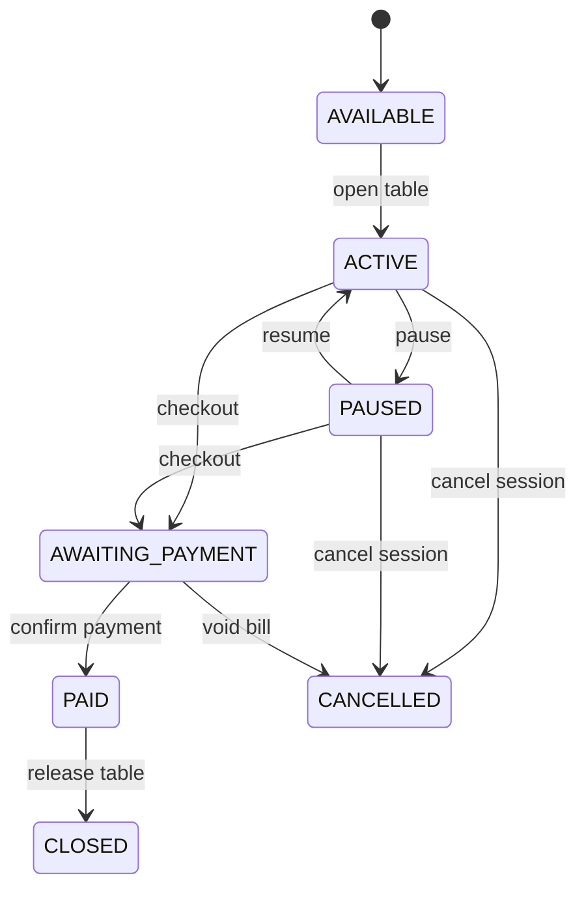

# Sprint 3: Billing, Payment Workflow & Audit Trail

## Scope and compatibility

JSON (`data/store.json`) remains the production store. SQLite code is not invoked. Existing route paths remain available; the checkout response now additionally returns a pending payment for cash or bank transfer, so the caller must confirm payment before the table is released.

## Workflow

`PAID` is represented by the bill/payment records; the session then moves from `AWAITING_PAYMENT` to `CLOSED`. This avoids treating a financial settlement as a second active table-session state.

## Billing and payment rules

- Checkout takes the pricing snapshot captured when the table opened, calculates in integer satang, and rounds up only once to whole baht.
- Checkout creates an immutable bill draft (`awaiting_payment`) and one pending payment.
- Supported new payment methods are `cash` and `transfer`. Existing `qr` pending records remain confirmable for compatibility; Sprint 3 does not add QR functionality.
- A payment must be at least the bill total. Duplicate, non-pending, or cancelled payments are rejected.
- Confirming a payment marks bill/payment paid, closes the session, turns relay off, and releases the table.
- Cancelling a pending payment leaves the bill/session awaiting payment so another payment may be created.
- `DELETE /api/bills/:id` is preserved but now voids instead of physically deleting records; pending payments are cancelled, and the table is released if still awaiting payment.

## Receipt numbers

New receipts use `YYYYMMDD-000001`, allocated from the highest existing receipt for the same date. The value is saved in both `number` and `receiptNumber` and is never changed after creation. Existing legacy receipt values remain untouched.

## Audit trail

`auditLogs` is an additive JSON array. Entries contain UUID, timestamp, event, table/session/bill/payment IDs when applicable, optional user ID, and details. The runtime never exposes a deletion operation for these records. Events include table open/pause/resume, session awaiting payment/cancelled/closed, draft creation, payment creation/confirmation/cancellation, and bill voiding.

## Backup and restore

The existing JSON backup copies the full store object, so the new `bills`, `payments`, and `auditLogs` fields are included without a format conversion. Restore replaces the loaded store only after JSON parsing and first creates a safety backup. A pre-Sprint-3 backup remains readable because all new collections are initialized lazily.

## Sprint 4 recommendation

Implement a narrowly scoped receipt/checkout UI that explicitly confirms cash or transfer payment and offers controlled void reasons. Do not begin POS, members, QR, or SQLite cutover in that sprint unless separately authorized.
