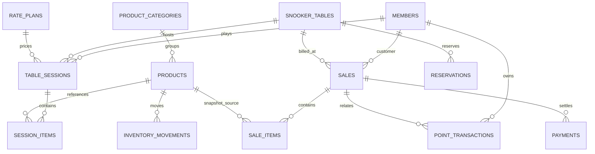

# Sprint 0 — Proposed SQLite Schema

`database/migrations/001_initial_schema.sql` is a prepared schema only. It is not invoked by `index.js`, no production database was created, and JSON remains live.

Key design choices:

- Every business entity uses a stable primary key; imported legacy IDs are preserved where possible.
- Foreign keys are declared and future database opens enforce `PRAGMA foreign_keys=ON`.
- Money uses `NUMERIC`; a later billing sprint must choose integer satang or fixed decimal discipline consistently.
- Sale/item snapshots retain receipt accuracy after product/member/table edits.
- `schema_migrations` provides version/checksum history. Indexes cover sessions, sales, payments, inventory, reservations.
- Reservations, inventory, points, rate plans and audit events are schema preparation only; no UI/API feature is enabled.
